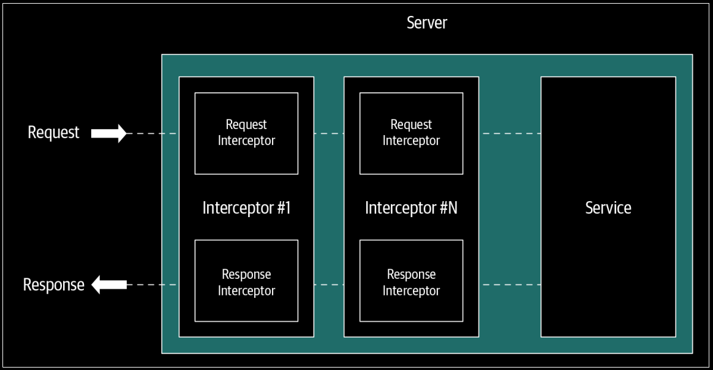
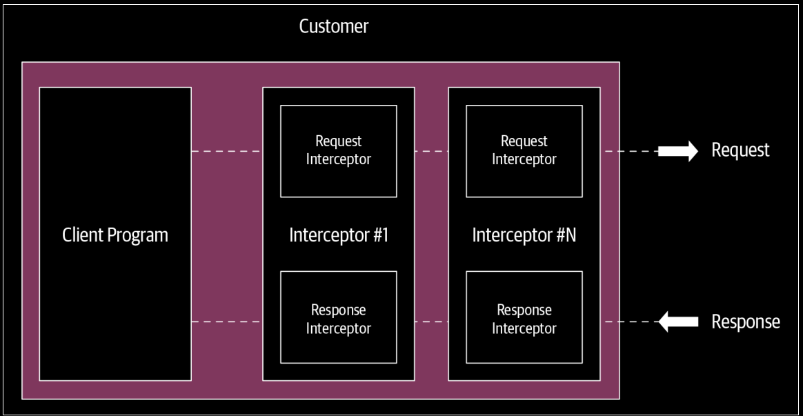
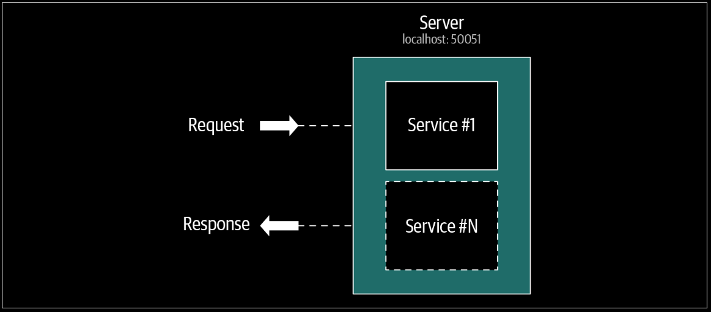
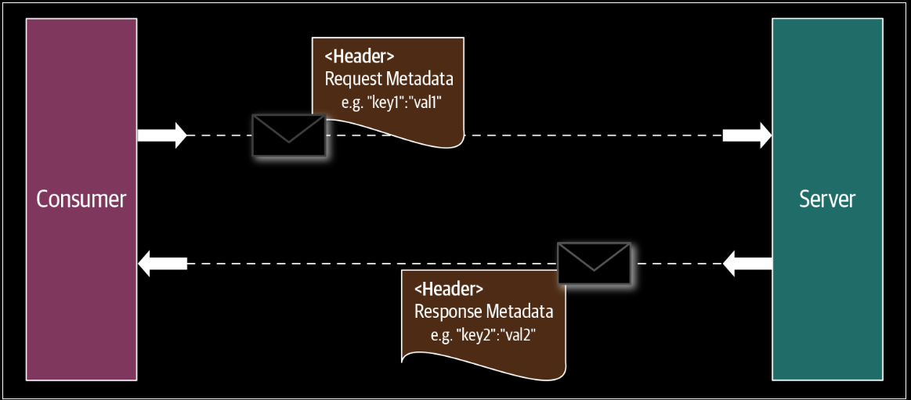
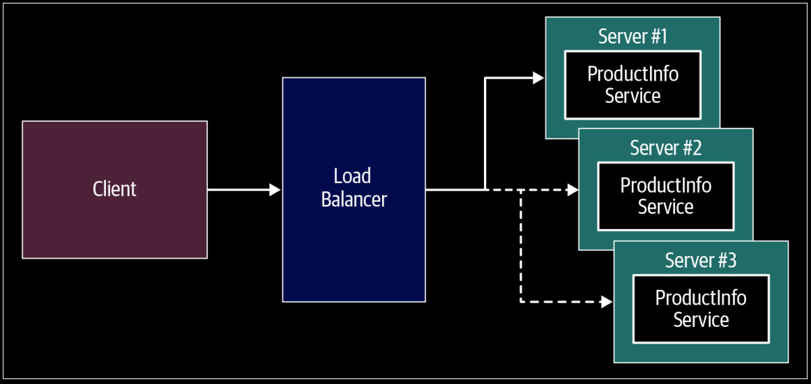
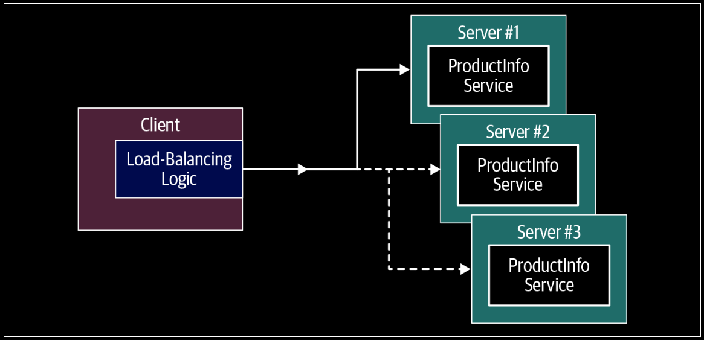

# gRPC: Beyond the Basics

## Interceptors
As you build gRPC applications, you may want to execute some common logic before or after the execution of the remote function, for either client or server applications.

In gRPC you can intercept that RPC’s execution to meet certain requirements such as logging, authentication, metrics, etc., using an extension mechanism called an interceptor.

gRPC interceptors can be categorized into two types based on the type of RPC calls they intercept. 
- unary RPC you can use unary interceptors
- streaming RPC you can use streaming interceptors

Both unary and streaming interceptor can be used on client or server side.

### Server-Side Interceptors
When a client invokes a remote method of a gRPC service, you can execute a common logic prior to the execution of the remote methods by using a server-side interceptor. You can plug one or more interceptors into any gRPC server that you develop.

<div align="center">
  
</div>

---

On the server side, the unary interceptor allows you to intercept the unary RPC call while the streaming interceptor intercepts the streaming RPC.

#### Server side - Unary interceptor

```go
// Server - Unary Interceptor
func orderUnaryServerInterceptor(ctx context.Context, req interface{},
	info *grpc.UnaryServerInfo, handler grpc.UnaryHandler) (interface{}, error) {

	// Preprocessing logic
	// Gets info about the current RPC call by examining the args passed in
	log.Println("======= [Unary Server Interceptor - Pre Message] : ", info.FullMethod)

	// Invoking the handler to complete the normal execution of a unary RPC.
	m, err := handler(ctx, req)

	// Post processing logic
	log.Printf("======= [Unary Server Interceptor - Post Message]  : %s", m)
	return m, err
}

func main() {
  ...
	// Registering the Interceptor at the server-side.
	s := grpc.NewServer(grpc.UnaryInterceptor(orderUnaryServerInterceptor))
  ...
}
```

#### Server side - Stream interceptor
The server-side streaming interceptor intercepts any streaming RPC calls that the gRPC server deals with. 

```go
// Server - Streaming Interceptor
// wrappedStream wraps around the embedded grpc.ServerStream,
// and intercepts the RecvMsg and SendMsg method call.

// Wrapper stream of the grpc.ServerStream.
type wrappedStream struct {
	grpc.ServerStream
}

// Implementing the RecvMsg function of the wrapper to
// process messages received with stream RPC.
func (w *wrappedStream) RecvMsg(m interface{}) error {
	log.Printf("====== [Server Stream Interceptor Wrapper] "+
		"Receive a message (Type: %T) at %s", m, time.Now().Format(time.RFC3339))
	return w.ServerStream.RecvMsg(m)
}

// Implementing the SendMsg function of the wrapper to
// process messages sent with stream RPC
func (w *wrappedStream) SendMsg(m interface{}) error {
	log.Printf("====== [Server Stream Interceptor Wrapper] "+
		"Send a message (Type: %T) at %v", m, time.Now().Format(time.RFC3339))
	return w.ServerStream.SendMsg(m)
}

// Creating an instance of the new wrapper stream from old server stream
func newWrappedStream(s grpc.ServerStream) grpc.ServerStream {
	return &wrappedStream{s}
}

func orderStreamServerInterceptor(srv interface{}, ss grpc.ServerStream,
	info *grpc.StreamServerInfo, handler grpc.StreamHandler) error {
	// Preprocessor phase.
	log.Println("====== [Server Stream Interceptor] ", info.FullMethod)
	// Invoking the streaming RPC with the wrapper stream.
	err := handler(srv, newWrappedStream(ss))
	if err != nil {
		log.Printf("RPC failed with error %v", err)
	}
	return err
}

func main() {
  ...
  s := grpc.NewServer(
		grpc.UnaryInterceptor(orderUnaryServerInterceptor),
		grpc.StreamInterceptor(orderStreamServerInterceptor),
	)
  ...
}
```

### Client-Side Interceptors
When a client invokes an RPC call to invoke a remote method of a gRPC service, you can intercept those RPC calls on the client side. Applicable to both unary and streaming calls.

This is particularly useful when you need to implement certain reusable features, such as securely calling a gRPC service outside the client application code.

<div align="center">
  
</div>

---

#### Client-Side - Unary interceptor
A client-side unary RPC interceptor is used for intercepting the unary RPC client side. `UnaryClientInterceptor` is the type for a client-side unary interceptor that has a function signature as follows.

```go
func orderUnaryClientInterceptor(ctx context.Context,
	method string, req, reply interface{}, cc *grpc.ClientConn,
	invoker grpc.UnaryInvoker, opts ...grpc.CallOption) error {
	// Preprocessor phase
	log.Println("Method : " + method)
	// Invoking the remote method
	err := invoker(ctx, method, req, reply, cc, opts...)
	// Postprocessor phase
	log.Println(reply)
	return err
}

func main() {
  ...
  // Setting up a connection to the server.
	conn, err := grpc.Dial(
		address,
		grpc.WithTransportCredentials(insecure.NewCredentials()),
		grpc.WithUnaryInterceptor(orderUnaryClientInterceptor))
  ...
}
```

#### Client-Side - Stream interceptor
The client-side streaming interceptor intercepts any streaming RPC calls that the gRPC client deals with. The implementation of the client-side stream interceptor is
quite similar to that of the server side.

```go
// a wrapper on client stream
type wrappedStream struct {
	grpc.ClientStream
}

func (w *wrappedStream) RecvMsg(m interface{}) error {
	log.Printf("====== [Client Stream Interceptor] "+
		"Receive a message (Type: %T) at %v",
		m, time.Now().Format(time.RFC3339))
	return w.ClientStream.RecvMsg(m)
}

func (w *wrappedStream) SendMsg(m interface{}) error {
	log.Printf("====== [Client Stream Interceptor] "+
		"Send a message (Type: %T) at %v",
		m, time.Now().Format(time.RFC3339))
	return w.ClientStream.SendMsg(m)
}

// get the wrapped stream of grpc by passing the actual stream
func newWrappedStream(s grpc.ClientStream) grpc.ClientStream {
	return &wrappedStream{s}
}

func clientStreamInterceptor(ctx context.Context, desc *grpc.StreamDesc,
	cc *grpc.ClientConn, method string, streamer grpc.Streamer, opts ...grpc.CallOption) (grpc.ClientStream, error) {
	log.Println("======= [Client Interceptor] ", method)
	s, err := streamer(ctx, desc, cc, method, opts...)
	if err != nil {
		return nil, err
	}
	return newWrappedStream(s), nil
}


func main() {
  ...
	// Setting up a connection to the server.
	conn, err := grpc.Dial(
		address,
		grpc.WithTransportCredentials(insecure.NewCredentials()),
		grpc.WithUnaryInterceptor(orderUnaryClientInterceptor),
		grpc.WithStreamInterceptor(clientStreamInterceptor))
  ...
}
```

## Deadlines
`Timeouts` allow you to specify how long a client application can wait for an RPC to complete before it terminates with an error. A timeout is usually specified as a duration and locally applied at each client side.

A single request may consist of multiple downstream RPCs that chain together multiple services. So we can apply timeouts, relative to each RPC, at each service invocation. Therefore, timeouts cannot be directly applied for the entire life cycle of the request. That’s where we need to use deadlines.

A `deadline` is expressed in absolute time from the beginning of a request and applied across multiple service invocations. The application that initiates the request sets the deadline and the entire request chain needs to respond by the deadline. gRPC APIs supports using deadlines.

For your RPC. For many reasons, it is always good practice to use deadlines in your gRPC applications. gRPC communication happens over the network, so there can be delays between the RPC calls and responses. 

Also, in certain cases the gRPC service itself can take more time to respond depending on the service’s business logic. When client applications are developed without using deadlines, they infinitely wait for a response for RPC requests that are initiated and resources will be held for all in-flight requests. This puts the service as well as the client at risk of running out of resources, increasing the latency of the service; this could even crash the entire gRPC service.

When client applications are developed without using deadlines, they infinitely wait for a response for RPC requests that are initiated and resources will be held for all in-flight requests. This puts the service as well as the client at risk of running out of resources, increasing the latency of the service; this could even crash the entire gRPC service.

Once the RPC call is made, the client application waits for the duration specified by the deadline; if the response for the RPC call is not received within that time, the RPC call is terminated with a `DEADLINE_EXCEEDED` error.

```go
func main() {
  ...
	clientDeadline := time.Now().Add(time.Duration(2 * time.Second))
	ctx, cancel := context.WithDeadline(context.Background(), clientDeadline)
	defer cancel()
  ...
}
```

When it comes to deadlines in gRPC, both the client and server can make their own independent and local determination about whether the RPC was successful; this means their conclusions may not match.

For instance, in our example, when the client meets the `DEADLINE_EXCEEDED` condition, the service may still try to respond. So, the service application needs to determine whether the current RPC is still valid or not. From the server side, you can also detect when the client has reached the deadline specified when invoking the RPC. Inside the AddOrder operation, you can check for `ctx.Err() == context.DeadlineExceeded` to find out whether the client has already met the deadline exceeded state, and then abandon the RPC at the server side and return an error (this is often implemented using a nonblocking select construct in Go).

## Cancellation
When either the client or server application wants to terminate the RPC this can be done by canceling the RPC. Once the RPC is canceled, no further RPC-related messaging can be done and the fact that one party has canceled the RPC is propagated to the other side.

In client RPC
```go
func main() {
  ...
	clientDeadline := time.Now().Add(time.Duration(2 * time.Second))
	ctx, cancel := context.WithDeadline(context.Background(), clientDeadline)
	
  // Canceling the RPC
  cancel()
  ...
}
```
Once you have the reference to `cancel`, you can call it at any location where you intend to terminate the RPC.

When one party cancels the RPC, the other party can determine it by checking the `context`. In this example, the server application can check whether the current context is canceled by using `stream.Context().Err() == context.Canceled`.

## Error Handling
When an error occurs, gRPC returns one of its error-status codes with an optional error message that provides more details of the error condition.

The status object is composed of an integer code and a string message that are common to all gRPC implementations for different languages.

| Code                | Number | Description                                                                                             |
|---------------------|--------|---------------------------------------------------------------------------------------------------------|
| OK                  | 0      | Success status                                                                                          |
| CANCELLED           | 1      | The operation was canceled (by the caller)                                                              |
| UNKNOWN             | 2      | Unknown error                                                                                           |
| INVALID_ARGUMENT    | 3      | The client specified an invalid argument.                                                               |
| DEADLINE_EXCEEDED   | 4      | The deadline expired before the operation could complete.                                               |
| NOT_FOUND           | 5      | Some requested entity was not found.                                                                    |
| ALREADY_EXISTS      | 6      | The entity that a client attempted to create already exists.                                            |
| PERMISSION_DENIED   | 7      | The caller does not have permission to execute the specified operation.                                 |
| RESOURCE_EXHAUSTED  | 8      | Some resource has been exhausted.                                                                       |
| FAILED_PRECONDITION | 9      | The operation was rejected because the system is not in a state required for the operation’s execution. |
| ABORTED             | 10     | The operation was aborted.                                                                              |
| OUT_OF_RANGE        | 11     | The operation was attempted past the valid range.                                                       |
| UNIMPLEMENTED       | 12     | The operation is not implemented or is not supported/enabled in this service.                           |
| INTERNAL            | 13     | Internal errors.                                                                                        |
| UNAVAILABLE         | 14     | The service is currently unavailable.                                                                   |
| DATA_LOSS           | 15     | Unrecoverable data loss or corruption.                                                                  |
| UNAUTHENTICATED     | 16     | The request does not have valid authentication credentials for the operation.                           |

```go
// server side code

func (s *server) AddOrder(ctx context.Context, orderReq *pb.Order) (*wrappers.StringValue, error) {
	if orderReq.Id == "-1" {
		log.Printf("Order ID is invalid! -> Received Order ID %s", orderReq.Id)

		errorStatus := status.New(codes.InvalidArgument, "Invalid information received")

		// Include any error details with an error type BadRequest_FieldViolation from
		// google.golang.org/genproto/googleapis/rpc/errdetails.
		ds, err := errorStatus.WithDetails(
			&epb.BadRequest_FieldViolation{
				Field:       "ID",
				Description: fmt.Sprintf("Order ID received is not valid %s : %s", orderReq.Id, orderReq.Description),
			},
		)
		// If there is some error generating the more details error response then return
		// the error response generated with status.New
		if err != nil {
			return nil, errorStatus.Err()
		}
		// return the error with details
		return nil, ds.Err()

	} else {
		orderMap[orderReq.Id] = *orderReq
		log.Println("Order : ", orderReq.Id, " -> Added")
		return &wrappers.StringValue{Value: "Order Added: " + orderReq.Id}, nil
	}
}
```

```go
// client code
	// Add Order
	// This is an invalid order
	order1 := pb.Order{Id: "-1", Items: []string{"iPhone XS", "Mac Book Pro"}, Destination: "San Jose, CA", Price: 2300.00}
	res, addOrderError := ordMgmtClient.AddOrder(ctx, &order1)

	if addOrderError != nil {
		// extract the error code out of status received
		errorCode := status.Code(addOrderError)
		// match the error code for InvlidArgumet
		if errorCode == codes.InvalidArgument {
			log.Printf("Invalid Argument Error : %s", errorCode)
			// convert the error response to get more details or print as is.
			errorStatus := status.Convert(addOrderError)
			for _, d := range errorStatus.Details() {
				switch info := d.(type) {
				case *epb.BadRequest_FieldViolation:
					log.Printf("Request Field Invalid: %s", info)
				default:
					log.Printf("Unexpected error type: %s", info)
				}
			}
		} else {
			log.Printf("Unhandled error : %s ", errorCode)
		}
	} else {
		log.Print("AddOrder Response -> ", res.Value)
	}
```

```bash
2023/05/20 11:31:16 Invalid Argument Error : InvalidArgument
2023/05/20 11:31:16 Request Field Invalid: field:"ID" description:"Order ID received is not valid -1 : "
```

## Multiplexing
gRPC allows you to run multiple gRPC services on the same gRPC server. Client application can reuse the same connection to invoke both the services as required. This capability is known as multiplexing.

<div align="center">
  
</div>

```go
// server side
func main() {
  ...
  initSampleData()
  lis, err := net.Listen("tcp", port)
  if err != nil {
    log.Fatalf("failed to listen: %v", err)
  }
  grpcServer := grpc.NewServer()

  // Register Order Management service on gRPC orderMgtServer
  ordermgt_pb.RegisterOrderManagementServer(grpcServer, &orderMgtServer{})
  // Register Greeter Service on gRPC orderMgtServer
  hello_pb.RegisterGreeterServer(grpcServer, &helloServer{})
  ...
}
```

```go
// client side
// Setting up a connection to the server.
conn, err := grpc.Dial(address, grpc.WithInsecure())
...
// Using the created gRPC connection to create an OrderManagement client.
orderManagementClient := pb.NewOrderManagementClient(conn)
...
// Add Order RPC
...
res, addErr := orderManagementClient.AddOrder(ctx, &order1)
...
// Using the same gRPC connection to create the Hello service client.
helloClient := hwpb.NewGreeterClient(conn)
...
// Say hello RPC
helloResponse, err := helloClient.SayHello(hwcCtx,&hwpb.HelloRequest{Name: "gRPC Up and Running!"})
```

#### Note
One powerful use for gRPC multiplexing in a microservice architecture is to host multiple major versions of the same service in one
server process. This allows a service to accommodate legacy clients after a breaking API change. Once the old version of the service
contract is no longer in use, it can be removed from the server.

## Metadata
You may want to share information about the RPC calls that are not related to the business context of the RPC, so they shouldn’t be part of the RPC
arguments. In such cases, you can use gRPC metadata that you can send or receive from either the gRPC service or the gRPC client using gRPC headers. Metadata is structured in the form of a list of key(string)/value pairs.

<div align="center">
  
</div>


### Creating and Retrieving Metadata

- Creating
```go
// Metadata Creation : option I
md := metadata.New(map[string]string{"key1": "val1", "key2": "val2"})
// Metadata Creation : option II  
// so that metadata with the same key will get merged into a list
md := metadata.Pairs(
  "key1", "val1",
  "key1", "val1-2", // "key1" will have map value []string{"val1", "val1-2"}
  "key2", "val2",
)
```

- Reading
```go
func (s *server) AddOrder(ctx context.Context, orderReq *pb.Order) (*wrappers.StringValue, error) {
  md, metadataAvailable := metadata.FromIncomingContext(ctx)
  // read the required metadata from the ‘md’ metadata map.
}
```

### Sending and Receiving Metadata: Client Side
We can create a new context with the new metadata using NewOutgoingContext, or simply append the metadata to the existing context using AppendToOutgoingContext. Using NewOutgoingContext, however, replaces any existing metadata in the context. Once you create a context with the required metadata, it can be used either for unary or streaming RPC

#### Sending metadata from the gRPC client side
```go
md := metadata.Pairs(
  "timestamp", time.Now().Format(time.StampNano),
  "kn", "vn",
)
// a new context
mdCtx := metadata.NewOutgoingContext(context.Background(), md)
// previous updated context
ctxA := metadata.AppendToOutgoingContext(mdCtx,
"k1", "v1", "k1", "v2", "k2", "v3")

// make unary RPC
response, err := client.SomeRPC(ctxA, someRequest)
// or make streaming RPC
stream, err := client.SomeStreamingRPC(ctxA)
```
Therefore, when it comes to receiving metadata from the client side, you need to treat them as either headers or trailers.

#### Reading metadata on the gRPC client side
```go
// variable to store header and trailer returned from the RPC call
var header, trailer metadata.MD

// ***** Unary RPC *****
// pass pointer to header and trailer not the value
r, err := client.SomeRPC(
  ctx,
  someRequest,
  grpc.Header(&header),
  grpc.Trailer(&trailer),
)
// process header and trailer map here.

// ***** Streaming RPC *****
stream, err := client.SomeStreamingRPC(ctx)
// retrieve header
header, err := stream.Header()
// retrieve trailer
trailer := stream.Trailer()
// process header and trailer map here.
```

### Sending and Receiving Metadata: Server Side

#### Reading metadata on the gRPC server side
```go
func (s *server) SomeRPC(ctx context.Context, in *pb.someRequest) (*pb.someResponse, error) {
  md, ok := metadata.FromIncomingContext(ctx)
  // do something with metadata
}

func (s *server) SomeStreamingRPC(stream pb.Service_SomeStreamingRPCServer) error {
  md, ok := metadata.FromIncomingContext(stream.Context())
  // do something with metadata
}
```

#### Sending metadata from the gRPC server side
To send metadata from the server side, send a header with metadata or set a trailer with metadata.

```go
func (s *server) SomeRPC(ctx context.Context, in *pb.someRequest) (*pb.someResponse, error) {
  // create and send header
  header := metadata.Pairs("header-key", "val")
  grpc.SendHeader(ctx, header)
  // create and set trailer
  trailer := metadata.Pairs("trailer-key", "val")
  grpc.SetTrailer(ctx, trailer)
}

func (s *server) SomeStreamingRPC(stream pb.Service_SomeStreamingRPCServer) error {
  // create and send header
  header := metadata.Pairs("header-key", "val")
  stream.SendHeader(header)
  // create and set trailer
  trailer := metadata.Pairs("trailer-key", "val")
  stream.SetTrailer(trailer)
}
```

## Load Balancing and NameResolver
Two main load-balancing mechanisms are commonly used in gRPC: a `load-balancer (LB) proxy` and `client-side load balancing`.

### Load-Balancer Proxy
In proxy load balancing, the client issues RPCs to the LB proxy. Then the LB proxy distributes the RPC call to one of the available backend gRPC servers that implements the actual logic for serving the call. The LB proxy keeps track of load on each backend server and offers a different load-balancing algorithm for distributing the load among the backend services.

<div align="center">
  
</div>

The topology of the backend services is not transparent to the gRPC clients, and they are only aware of the load balancer’s endpoint. Therefore, on the client side, you don’t need to make any changes to cater to a load-balancing use case, apart from using the
load balancer’s endpoint as the destination for all your gRPC connections. The backend services can report the load status back to the load balancer so that it can use that information for the load-balancing logic. load-balancing solutions such as `Nginx`, `Envoy proxy`, etc.

If you don’t use a gRPC load balancer, then you can implement the load-balancing logic as part of the client applications you write. That is client side load balancing.

### Client-Side Load Balancing
Rather than having an intermediate proxy layer for load balancing, you can implement the load-balancing logic at the gRPC client level. In this method, the client is aware of multiple backend gRPC servers and chooses one to use for each RPC. The load-balancing logic may be entirely developed as part of the client application (also known as `thick client`) or it can be implemented in a dedicated server known as `lookaside load balancer`. Then the client can query it to obtain the best gRPC server to connect to. The client directly connects to the gRPC server address obtained by the lookaside load balancer.

<div align="center">
  
</div>

Suppose we have two backend gRPC services running an echo server on `:50051` and `:50052`. These two servers as two members of an echo gRPC service cluster. Suppose we want to build a gRPC client application that uses the round-robin algorithm when selecting the
gRPC server endpoint and another client that uses the first endpoint of the server endpoint list. 

We will see a thick client implementation. The client is dialing `example:///lb.example.grpc.io`. So, we are using the `example` as **scheme** name and `lb.example.grpc.io` as the **server** name.

Based on this scheme, it will look for a name resolver to discover the absolute value for the backend service address. Based on the list of values the name resolver returns, gRPC runs different load-balancing algorithms against those servers. The behavior is configured with `grpc.WithBalancerName("round_robin")`.

### Server Code
```go
package main

import (
	"context"
	"fmt"
	"log"
	"net"
	"sync"

	"google.golang.org/grpc"
	"google.golang.org/grpc/codes"
	ecpb "google.golang.org/grpc/examples/features/proto/echo"
	"google.golang.org/grpc/status"
)

var (
	addrs = []string{":50051", ":50052"}
)

type ecServer struct {
	ecpb.EchoServer
	addr string
}

func (s *ecServer) UnaryEcho(ctx context.Context, req *ecpb.EchoRequest) (*ecpb.EchoResponse, error) {
	return &ecpb.EchoResponse{Message: fmt.Sprintf("%s (from %s)", req.Message, s.addr)}, nil
}
func (s *ecServer) ServerStreamingEcho(*ecpb.EchoRequest, ecpb.Echo_ServerStreamingEchoServer) error {
	return status.Errorf(codes.Unimplemented, "not implemented")
}
func (s *ecServer) ClientStreamingEcho(ecpb.Echo_ClientStreamingEchoServer) error {
	return status.Errorf(codes.Unimplemented, "not implemented")
}
func (s *ecServer) BidirectionalStreamingEcho(ecpb.Echo_BidirectionalStreamingEchoServer) error {
	return status.Errorf(codes.Unimplemented, "not implemented")
}

func startServer(addr string) {
	lis, err := net.Listen("tcp", addr)
	if err != nil {
		log.Fatalf("failed to listen: %v", err)
	}
	s := grpc.NewServer()
	ecpb.RegisterEchoServer(s, &ecServer{addr: addr})
	log.Printf("serving on %s\n", addr)
	if err := s.Serve(lis); err != nil {
		log.Fatalf("failed to serve: %v", err)
	}
}

func main() {
	var wg sync.WaitGroup
	for _, addr := range addrs {
		wg.Add(1)
		go func(addr string) {
			defer wg.Done()
			startServer(addr)
		}(addr)
	}
	wg.Wait()
}
```
```bash
$ go run server.go 
2023/05/21 20:12:08 serving on :50052
2023/05/21 20:12:08 serving on :50051
```

### Client Code
```go
package main

import (
	"context"
	"fmt"
	"log"
	"time"

	"google.golang.org/grpc"
	"google.golang.org/grpc/credentials/insecure"
	ecpb "google.golang.org/grpc/examples/features/proto/echo"
	"google.golang.org/grpc/resolver"
)

const (
	exampleScheme      = "example"
	exampleServiceName = "lb.example.grpc.io"
)

var addrs = []string{"localhost:50051", "localhost:50052"}

func callUnaryEcho(c ecpb.EchoClient, message string) {
	ctx, cancel := context.WithTimeout(context.Background(), time.Second)
	defer cancel()
	r, err := c.UnaryEcho(ctx, &ecpb.EchoRequest{Message: message})
	if err != nil {
		log.Fatalf("could not greet: %v", err)
	}
	fmt.Println(r.Message)
}

func makeRPCs(cc *grpc.ClientConn, n int) {
	hwc := ecpb.NewEchoClient(cc)
	for i := 0; i < n; i++ {
		callUnaryEcho(hwc, "this is examples/load_balancing")
	}
}

func main() {
	pickfirstConn, err := grpc.Dial(
		fmt.Sprintf("%s:///%s", exampleScheme, exampleServiceName), // "example:///lb.example.grpc.io"
		// grpc.WithBalancerName("pick_first"), // "pick_first" is the default, so this DialOption is not necessary.
		grpc.WithTransportCredentials(insecure.NewCredentials()),
	)
	if err != nil {
		log.Fatalf("did not connect: %v", err)
	}
	defer pickfirstConn.Close()

	log.Println("==== Calling helloworld.Greeter/SayHello with pick_first ====")
	makeRPCs(pickfirstConn, 10)

	// Make another ClientConn with round_robin policy.
	roundrobinConn, err := grpc.Dial(
		fmt.Sprintf("%s:///%s", exampleScheme, exampleServiceName), // // "example:///lb.example.grpc.io"
		// grpc.WithBalancerName("round_robin"),                       // This sets the initial balancing policy.
		grpc.WithTransportCredentials(insecure.NewCredentials()),
		grpc.WithDefaultServiceConfig(`{"loadBalancingPolicy":"round_robin"}`),
	)
	if err != nil {
		log.Fatalf("did not connect: %v", err)
	}
	defer roundrobinConn.Close()

	log.Println("==== Calling helloworld.Greeter/SayHello with round_robin ====")
	makeRPCs(roundrobinConn, 10)
}

// Name resolver implementation

type exampleResolverBuilder struct{}

func (*exampleResolverBuilder) Build(
	target resolver.Target,
	cc resolver.ClientConn,
	opts resolver.BuildOptions) (resolver.Resolver, error) {
	r := &exampleResolver{
		target: target,
		cc:     cc,
		addrsStore: map[string][]string{
			exampleServiceName: addrs, // "lb.example.grpc.io": "localhost:50051", "localhost:50052"
		},
	}
	r.start()
	return r, nil
}
func (*exampleResolverBuilder) Scheme() string { return exampleScheme } // "example"

type exampleResolver struct {
	target     resolver.Target
	cc         resolver.ClientConn
	addrsStore map[string][]string
}

func (r *exampleResolver) start() {
	addrStrs := r.addrsStore[r.target.Endpoint()]
	addrs := make([]resolver.Address, len(addrStrs))
	for i, s := range addrStrs {
		addrs[i] = resolver.Address{Addr: s}
	}
	r.cc.UpdateState(resolver.State{Addresses: addrs})
}
func (*exampleResolver) ResolveNow(o resolver.ResolveNowOptions) {}
func (*exampleResolver) Close()                                  {}

func init() {
	resolver.Register(&exampleResolverBuilder{})
}
```
```bash
$ go run client.go 
2023/05/21 20:17:48 ==== Calling helloworld.Greeter/SayHello with pick_first ====
this is examples/load_balancing (from :50051)
this is examples/load_balancing (from :50051)
this is examples/load_balancing (from :50051)
this is examples/load_balancing (from :50051)
this is examples/load_balancing (from :50051)
this is examples/load_balancing (from :50051)
this is examples/load_balancing (from :50051)
this is examples/load_balancing (from :50051)
this is examples/load_balancing (from :50051)
this is examples/load_balancing (from :50051)
2023/05/21 20:17:48 ==== Calling helloworld.Greeter/SayHello with round_robin ====
this is examples/load_balancing (from :50052)
this is examples/load_balancing (from :50051)
this is examples/load_balancing (from :50052)
this is examples/load_balancing (from :50051)
this is examples/load_balancing (from :50052)
this is examples/load_balancing (from :50051)
this is examples/load_balancing (from :50052)
this is examples/load_balancing (from :50051)
this is examples/load_balancing (from :50052)
this is examples/load_balancing (from :50051)
```

## Compression

#### Client Code
```go
import (
  "google.golang.org/grpc/encoding/gzip"
)

func main() {
  ...
  res, addOrderError := ordMgmtClient.AddOrder(newMdCtx, &order1, grpc.UseCompressor(gzip.Name))
  ...
}
```

#### Server Code
```go
import (
	_ "google.golang.org/grpc/encoding/gzip" // importing just to make server eligible to accept compressed data
)

func (s *server) AddOrder(ctx context.Context, orderReq *pb.Order) (*wrappers.StringValue, error) {
  md, _ := metadata.FromIncomingContext(ctx)
	log.Println("----  AddOrder Incomming Metadata : ", md, " ------")
  ...
}
```
```bash
----  AddOrder Incomming Metadata :  map[:authority:[localhost:8000] content-type:[application/grpc] grpc-accept-encoding:[gzip] hello:[world] timestamp:[May 21 21:56:47.388441599] user-agent:[grpc-go/1.55.0]]  ------
```
