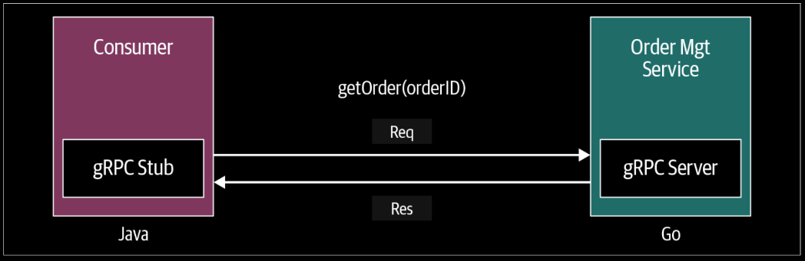
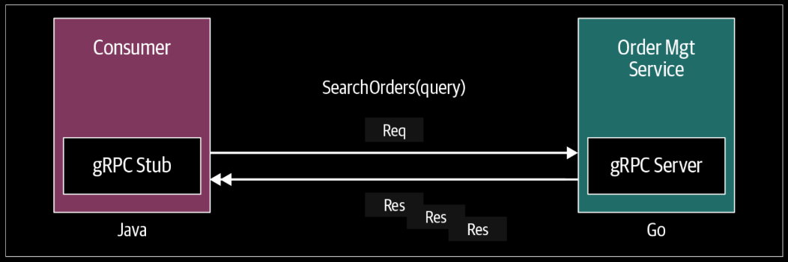

# gRPC Communication Patterns

## Patterns in gRPC
- Simple RPC (Unary RPC)
- Server Streaming RPC
- Client Streaming RPC
- Bidirectional Streaming RPC

## Simple RPC (Unary RPC)

<div align="center">
    
</div>

---

In simple RPC, when a client invokes a remote function of a server, the client sends a single request to the server and gets a single response that is sent along with status details and trailing metadata.

Build an OrderManagement service. With a method `getOrder` method, where the client can retrieve an existing order by providing the order ID.

Generate Server
```bash
protoc --go_out=. --go_opt=MOrderMgmt.proto=server/ecommerce --go-grpc_out=. --go-grpc_opt=MOrderMgmt.proto=server/ecommerce OrderMgmt.proto
```
Generate Client
```bash
protoc --go_out=. --go_opt=MOrderMgmt.proto=client/ecommerce --go-grpc_out=. --go-grpc_opt=MOrderMgmt.proto=client/ecommerce OrderMgmt.proto
```

### Server Code
```go
package main

import (
	pb "OrderManagement/ecommerce"
	"context"
	"log"
	"net"

	"github.com/golang/protobuf/ptypes/wrappers"
	"google.golang.org/grpc"
	"google.golang.org/grpc/codes"
	"google.golang.org/grpc/status"
)

const (
	port = ":8000"
)

var orderMap = make(map[string]pb.Order)

type server struct {
	pb.UnimplementedOrderManagementServer
}

func (s *server) GetOrder(ctx context.Context, orderId *wrappers.StringValue) (*pb.Order, error) {
	ord, found := orderMap[orderId.Value]
	if !found {
		return nil, status.Errorf(codes.NotFound, "Product does not exists : %s", orderId.Value)
	}
	return &ord, nil
}

func main() {
	// put some data in map
	orderMap["106"] = pb.Order{
		Items:       []string{"Banana", "Mango"},
		Description: "Fruit Basket",
		Price:       202,
		Destination: "Fruit Market",
	}

	lis, err := net.Listen("tcp", port)
	if err != nil {
		log.Fatalf("failed to listen: %v", err)
	}
	s := grpc.NewServer()
	pb.RegisterOrderManagementServer(s, &server{})
	if err := s.Serve(lis); err != nil {
		log.Fatalf("failed to serve: %v", err)
	}
}
```

### Client Code
```go
package main

import (
	pb "OrderManagement/ecommerce"
	"context"
	wrappers "github.com/golang/protobuf/ptypes/wrappers"
	"google.golang.org/grpc"
	"google.golang.org/grpc/credentials/insecure"
	"log"
	"time"
)

const (
	address = "localhost:8000"
)

func main() {
	// Set up a connection with the server from the
	// provided address ("localhost: 8000")
	conn, err := grpc.Dial(address, grpc.WithTransportCredentials(insecure.NewCredentials()))
	if err != nil {
		log.Fatalf("did not connect: %v", err)
	}
	defer conn.Close()
	// Pass the connection and create a stub. This stub
	// instance contains all the remote methods to invoke the server.
	ordMgmtClient := pb.NewOrderManagementClient(conn)

	// Create a Context to pass with the remote call. Here
	// the Context object contains metadata such as the identity
	// of the end user, authorization tokens, and the request’s
	// deadline and it will exist during the lifetime of the request.
	ctx, cancel := context.WithTimeout(context.Background(), time.Second)
	defer cancel()

	// call GetOrder method with product details
	retrievedOrder, err := ordMgmtClient.GetOrder(ctx, &wrappers.StringValue{Value: "106"})
	if err != nil {
		log.Fatalf("Could not add product: %v", err)
	}
	log.Print("GetOrder Response -> : ", retrievedOrder)
}
```
```
2023/05/10 10:23:46 GetOrder Response -> : items:"Banana"  items:"Mango"  description:"Fruit Basket"  price:202  destination:"Fruit Market"
```

## Server-Streaming RPC

<div align="center">
    
</div>

---

In server-side streaming RPC, the server sends back a sequence of responses after getting the client’s request message.
This sequence of multiple responses is known as a “stream.” After sending all the server responses, the server marks the end of the stream by sending the server’s status details as trailing metadata to the client.

For a search capability. Rather than sending all the matching orders at once, the `OrderManagement` service can send
the orders as and when they are found. This means the order service client will receive multiple response messages for a single request that it has sent.
