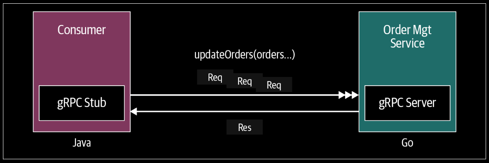

# gRPC Communication Patterns

## Patterns in gRPC
- Simple RPC (Unary RPC)
- Server Streaming RPC
- Client Streaming RPC
- Bidirectional Streaming RPC

## Simple RPC (Unary RPC)

<div align="center">
    
</div>

---

In simple RPC, when a client invokes a remote function of a server, the client sends a single request to the server and gets a single response that is sent along with status details and trailing metadata.

Build an OrderManagement service. With a method `getOrder` method, where the client can retrieve an existing order by providing the order ID.

Generate Server
```bash
protoc --go_out=. --go_opt=MOrderMgmt.proto=server/ecommerce --go-grpc_out=. --go-grpc_opt=MOrderMgmt.proto=server/ecommerce OrderMgmt.proto
```
Generate Client
```bash
protoc --go_out=. --go_opt=MOrderMgmt.proto=client/ecommerce --go-grpc_out=. --go-grpc_opt=MOrderMgmt.proto=client/ecommerce OrderMgmt.proto
```

### Proto File
```protobuf
syntax = "proto3";

// Use this package to leverage the well-known types such as StringValue
import "google/protobuf/wrappers.proto";

package ecommerce;

service OrderManagement {
  rpc getOrder(google.protobuf.StringValue) returns (Order);
}

// Define the Order type
message Order  {
  string id = 1;
  // repeated is used to represent the fields that can be repeated 
  // any number of times including zero in a message
  repeated string items = 2;
  string description = 3;
  float price = 4;
  string destination = 5;
}
```

### Server Code
```go
package main

import (
	pb "OrderManagement/ecommerce"
	"context"
	"log"
	"net"

	"github.com/golang/protobuf/ptypes/wrappers"
	"google.golang.org/grpc"
	"google.golang.org/grpc/codes"
	"google.golang.org/grpc/status"
)

const (
	port = ":8000"
)

var orderMap = make(map[string]pb.Order)

type server struct {
	pb.UnimplementedOrderManagementServer
}

func (s *server) GetOrder(ctx context.Context, orderId *wrappers.StringValue) (*pb.Order, error) {
	ord, found := orderMap[orderId.Value]
	if !found {
		return nil, status.Errorf(codes.NotFound, "Product does not exists : %s", orderId.Value)
	}
	return &ord, nil
}

func main() {
	// put some data in map
	orderMap["106"] = pb.Order{
		Items:       []string{"Banana", "Mango"},
		Description: "Fruit Basket",
		Price:       202,
		Destination: "Fruit Market",
	}

	lis, err := net.Listen("tcp", port)
	if err != nil {
		log.Fatalf("failed to listen: %v", err)
	}
	s := grpc.NewServer()
	pb.RegisterOrderManagementServer(s, &server{})
	if err := s.Serve(lis); err != nil {
		log.Fatalf("failed to serve: %v", err)
	}
}
```

### Client Code
```go
package main

import (
	pb "OrderManagement/ecommerce"
	"context"
	wrappers "github.com/golang/protobuf/ptypes/wrappers"
	"google.golang.org/grpc"
	"google.golang.org/grpc/credentials/insecure"
	"log"
	"time"
)

const (
	address = "localhost:8000"
)

func main() {
	// Set up a connection with the server from the
	// provided address ("localhost: 8000")
	conn, err := grpc.Dial(address, grpc.WithTransportCredentials(insecure.NewCredentials()))
	if err != nil {
		log.Fatalf("did not connect: %v", err)
	}
	defer conn.Close()
	// Pass the connection and create a stub. This stub
	// instance contains all the remote methods to invoke the server.
	ordMgmtClient := pb.NewOrderManagementClient(conn)

	// Create a Context to pass with the remote call. Here
	// the Context object contains metadata such as the identity
	// of the end user, authorization tokens, and the request’s
	// deadline and it will exist during the lifetime of the request.
	ctx, cancel := context.WithTimeout(context.Background(), time.Second)
	defer cancel()

	// call GetOrder method with product details
	retrievedOrder, err := ordMgmtClient.GetOrder(ctx, &wrappers.StringValue{Value: "106"})
	if err != nil {
		log.Fatalf("Could not add product: %v", err)
	}
	log.Print("GetOrder Response -> : ", retrievedOrder)
}
```
```bash
2023/05/10 10:23:46 GetOrder Response -> : items:"Banana"  items:"Mango"  description:"Fruit Basket"  price:202  destination:"Fruit Market"
```

## Server-Streaming RPC

<div align="center">
    
</div>

---

In server-side streaming RPC, the server sends back a sequence of responses after getting the client’s request message.
This sequence of multiple responses is known as a “stream.” After sending all the server responses, the server marks the end of the stream by sending the server’s status details as trailing metadata to the client.

For a search capability. Rather than sending all the matching orders at once, the `OrderManagement` service can send
the orders as and when they are found. This means the order service client will receive multiple response messages for a single request that it has sent.

### Proto File
```protobuf
...

service OrderManagement {
  rpc getOrder(google.protobuf.StringValue) returns (Order);
  rpc searchOrders(google.protobuf.StringValue) returns (stream Order);
}

...
```

Don't forget to generate the client and server code using the same commands. We retrieve messages from the client-side stream using the Recv()
method and keep doing so until we reach the end of the stream.

### Server Code
```go
// server streaming
func (s *server) SearchOrders(searchQuery *wrappers.StringValue, stream pb.OrderManagement_SearchOrdersServer) error {
	for _, order := range orderMap {
		for _, itemStr := range order.Items {
			if strings.Contains(itemStr, searchQuery.Value) {
				err := stream.Send(&order)
				if err != nil {
					return fmt.Errorf("error sending message to stream : %v", err)
				}
				break
			}
		}
	}
	return nil
}
```
The `SearchOrders` method has two parameters: `searchQuery`, a string value, and a special parameter `OrderManagement_SearchOrdersServer` to write our response. When a new order is found, it is written to the stream using the Send(…) method of the stream reference object.

Once all the responses are written to the stream you can mark the end of the stream by returning nil, and the server status and other trailing metadata will be sent
to the client.

### Client Code
```go
	// server streaming client
	searchStream, _ := ordMgmtClient.SearchOrders(ctx, &wrappers.StringValue{Value: "Mouse"})
	for {
		searchOrder, err := searchStream.Recv()
		if err == io.EOF {
			break
		}
		// handle other possible errors
		log.Print("Search Result : ", searchOrder)
	}
```
```bash
2023/05/13 19:04:08 GetOrder Response -> : items:"Banana" items:"Mango" description:"Fruit Basket" price:202 destination:"Fruit Market"
2023/05/13 19:04:08 
-----------------------------------------------------------------------------
2023/05/13 19:04:08 Search Result : items:"Mouse" items:"KeyBoard" description:"Digital Basket" price:202 destination:"Digital Market"
2023/05/13 19:04:08 
```
we retrieve messages from the client-side stream using the `Recv()` method and keep doing so until we reach the end of the stream.


## Client-Streaming RPC
The client sends multiple messages to the server instead of a single request. The server sends back a single response to the client. However, the server does not necessarily have to wait until it receives all the messages from the client side to send a response. Based on this logic you may send the response after reading one or a few messages from the stream or after reading all the messages.

`updateOrders`, in the `OrderManagement` service to update a set of orders. Here we want to send the order list as a stream of messages to the server and server will process that stream and send a message with the status of the orders that are updated.

<div align="center">
    
</div>

---

### Proto File
```protobuf
...

service OrderManagement {
  rpc getOrder(google.protobuf.StringValue) returns (Order);
  rpc searchOrders(google.protobuf.StringValue) returns (stream Order);
  rpc updateOrders(stream Order) returns (google.protobuf.StringValue);
}

...
```

### Server Code
In server side you may read a few messages or all the messages until the end of the stream. The service can send its response simply by calling the `SendAndClose` method of the `OrderManagement_UpdateOrdersServer` object, which also marks the end of the stream for server-side messages. If the server decides to prematurely stop reading from the client’s stream, the server should cancel the client stream so the client knows to stop producing messages.

```go
func (s *server) UpdateOrders(stream pb.OrderManagement_UpdateOrdersServer) error {
	ordersStr := "Updated Order IDs : "
	for {
		// Read message from the client stream.
		order, err := stream.Recv()
		// Check for end of stream.
		if err == io.EOF {
			// Finished reading the order stream.
			return stream.SendAndClose(
				&wrappers.StringValue{Value: "Orders processed " + ordersStr})
		}
		// Update order
		orderMap[order.Id] = *order

		log.Printf("Order ID ", order.Id, ": Updated")
		ordersStr += order.Id + ", "
	}
}
```

### Client Code
Once all the messages are streamed the client can mark the end of the stream and receive the response from the service.

```go
	// Update Orders : Client streaming scenario
	updOrder1 := pb.Order{Id: "102", Items: []string{"Google Pixel 3A", "Google Pixel Book"}, Destination: "Mountain View, CA", Price: 1100.00}
	updOrder2 := pb.Order{Id: "103", Items: []string{"Apple Watch S4", "Mac Book Pro", "iPad Pro"}, Destination: "San Jose, CA", Price: 2800.00}
	updOrder3 := pb.Order{Id: "104", Items: []string{"Google Home Mini", "Google Nest Hub", "iPad Mini"}, Destination: "Mountain View, CA", Price: 2200.00}

	// Updating order 1
	if err := updateStream.Send(&updOrder1); err != nil {
		log.Fatalf("%v.Send(%v) = %v", updateStream, updOrder1, err)
	}
	// Updating order 2
	if err := updateStream.Send(&updOrder2); err != nil {
		log.Fatalf("%v.Send(%v) = %v", updateStream, updOrder2, err)
	}
	// Updating order 3
	if err := updateStream.Send(&updOrder3); err != nil {
		log.Fatalf("%v.Send(%v) = %v", updateStream, updOrder3, err)
	}

	// Closing the stream and receiving the response.
	updateRes, err := updateStream.CloseAndRecv()
	if err != nil {
		log.Fatalf("%v.CloseAndRecv() got error %v, want %v",
			updateStream, err, nil)
	}
	log.Printf("Update Orders Res : %s", updateRes)
```

```bash
2023/05/13 19:04:08 GetOrder Response -> : items:"Banana" items:"Mango" description:"Fruit Basket" price:202 destination:"Fruit Market"
2023/05/13 19:04:08 
-----------------------------------------------------------------------------
2023/05/13 19:04:08 Search Result : items:"Mouse" items:"KeyBoard" description:"Digital Basket" price:202 destination:"Digital Market"
2023/05/13 19:04:08 
-----------------------------------------------------------------------------
2023/05/13 19:04:08 Update Orders Res : value:"Orders processed Updated Order IDs : 102, 103, 104, "
2023/05/13 19:04:08 
-----------------------------------------------------------------------------
```

## Bidirectional-Streaming RPC
