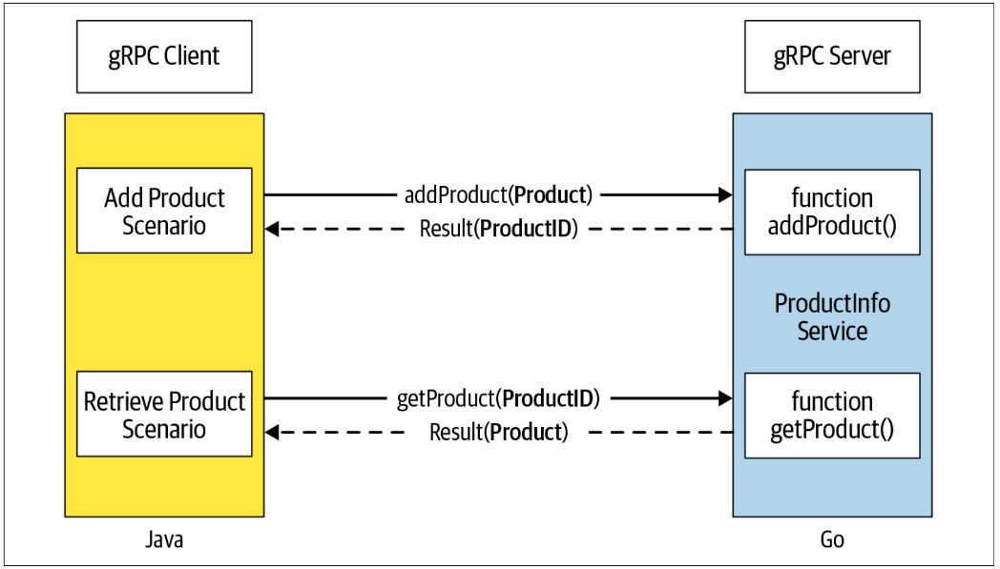

# Getting Started with gRPC

<div align="center">
    
</div>

---

## Implement Server - GoLang
First, we need to generate the stubs for the service definition, then we implement the business logic of all the remote methods of the service, and finally, we create a server listening on a specified port and register the service to accept client requests.

1. Make sure `protoc` compiler is installed.
```bash
$ protoc --version
libprotoc 3.12.4
```
2. Install the gRPC library for GoLang
```bash
go get google.golang.org/grpc
go get google.golang.org/protobuf/cmd/protoc-gen-go
go get google.golang.org/grpc/cmd/protoc-gen-go-grpc
```

3. Create Go Stub/Client
```bash
protoc --go_out=. --go_opt=Mproto/product_info.proto=productinfo/server/ecommerce --go-grpc_out=. --go-grpc_opt=Mproto/product_info.proto=productinfo/server/ecommerce proto/product_info.proto
```
- In above command `--go_out=.` means when the compiler output the stub file in respective location it don't end up creating further nesting.
- `--go_opt=M{proto_file_location}={stub_file_location}`  
- In the end `proto/product_info.proto` is the location of all the proto files which are used in generating stub. Without this we get error `Missing input file.`
- Similarly genearate the `_grpc.pb.go` file as well.

The resulting structure will look like this
```bash
├── productinfo
│   ├── client
│   │   ├── go.mod
│   │   └── go.sum
│   └── server
│       ├── ecommerce
│       │   └── product_info.pb.go
│       ├── go.mod
│       └── go.sum
├── proto
│   └── product_info.proto
```

Implemented the server in `getting_started/productinfo/server/main.go`

```bash
├── productinfo
│   ├── client
│   │   ├── go.mod
│   │   └── go.sum
│   └── server
│       ├── ecommerce
│       │   ├── product_info_grpc.pb.go
│       │   └── product_info.pb.go
│       ├── go.mod
│       ├── go.sum
│       └── main.go
├── proto
│   └── product_info.proto
```
- Run server as `go run main.go` while in server directory.

## Implement Server - GoLang
Client and Server can be in different languages but I am going ahead with GoLang for consistency.

1. Create Go Stub/Client
```bash
protoc --go_out=. --go_opt=Mproto/product_info.proto=productinfo/client/ecommerce --go-grpc_out=. --go-grpc_opt=Mproto/product_info.proto=productinfo/client/ecommerce proto/product_info.proto
```
2. Hit the client while the server is running.
```bash
$ go run main.go 
2023/05/02 00:00:49 Product ID: c80f6c87-3bc1-4747-94dc-8881e3f2cef0 added successfully
2023/05/02 00:00:49 Product: id:"c80f6c87-3bc1-4747-94dc-8881e3f2cef0"  name:"Apple iPhone 11"  description:"Meet Apple iPhone 11. All-new dual-camera \n\tsystem with Ultra Wide and Night mode."
```
