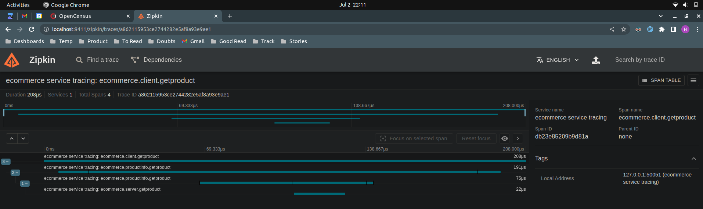

# gRPC in Production

## Testing a gRPC Server
The server-side testing consists of starting a gRPC server with the required  gRPC service and then 
connecting to the server using the client application where you implement your test cases.

One special thing about the server-side gRPC tests is that they require the server application to open 
up a port  the client application connects to. If you prefer not to do this, or your testing environment 
doesn’t allow it, you can use a library to help avoid starting up a service with a real port number. 
In Go, you can use the `bufconn package`.

## Testing a gRPC Client
To test client-side logic without the overhead of  connecting to a real server, you can use a mocking 
framework. Mocking of the gRPC server side enables developers to write lightweight unit tests to check 
functionalities  on the client side without invoking RPC calls to a server.

Check this file for server: `grpc_in_production/server/main.go`
Check this file for server test: `grpc_in_production/server/prodinfo_test.go`

Run test using
```bash
# grpc_in_production/server
$ go test .
```
Here we tested `AddProduct` using both HTTP server connection (actually starting a server in gorouting) and 
using mock/buffer (without starting a server). 

If you are developing a gRPC client application with Go, you can use `Gomock` to  mock the client interface 
(using the generated code) and programmatically set its methods to expect and return predetermined values. 
Using `Gomock`, you can generate mock interfaces for the gRPC client application using:
```bash
$ mockgen grpc_prod/proto-gen ProductInfoClient > mock_prodinfo/prodinfo_mock.go
```

Here, we’ve specified `ProductInfoClient` as the interface to be mocked. Then the test code you write can 
import the package generated by `mockgen` along with the `gomock` package to write unit tests around client-side logic.

Package generated by mockgen: `grpc_in_production/mock_prodinfo/prodinfo_mock.go`
Package for testing mockgen generated package: `grpc_in_production/mock_prodinfo/prodinfo_mock_test.go`

```bash
# ProductInfoClient interface inside productinfo_grpc.pb.go
# this will be mocked in prodinfo_mock.go generated package

type ProductInfoClient interface {
	AddProduct(ctx context.Context, in *Product, opts ...grpc.CallOption) (*ProductID, error)
	GetProduct(ctx context.Context, in *ProductID, opts ...grpc.CallOption) (*Product, error)
}
```

In practice, you can verify a selected set of capabilities via mocking and the rest needs to be verified against 
the actual gRPC server implementation.

## Load Testing
we need tailor-made load-testing tools that can load test the gRPC server by generating a virtual load of RPCs to the server.

`ghz` is such a load-testing tool; it is implemented as a command-line utility using Go. 
It can be used for testing and debugging services locally, and also in automated continuous integration environments for performance regression testing.

- Download `ghz` from https://github.com/bojand/ghz/releases with name  *ghz-linux-x86_64.tar.gz*
- Extract and place the binaries in `/usr/local/ghz`
```bash
$ ls /usr/local/ghz/
ghz  ghz-web  LICENSE
```
- Set the `PATH` to these binaries
```bash
# ~/.bashrc

# ghz binary - grpc load testing
export PATH="$PATH:/usr/local/ghz/"
```

Run below command after starting server 
- `insecure` means insecure command
- `--proto` location to .proto file from current location
- `--call` Packagename.ServiceName.MethodName in protofile
- `-d` data which need to sent in request as a valid json string
- `-n` number of request to invoke
- `-c` no of goroutines to spin **Server should be thread safe for this or it will exit with error and client will see `Connection Refused`**
- `0.0.0.0:50051` is the host and port on which server is listening

```bash
#$ pwd
#/home/lenovo/dev/gRPC/grpc_in_production

ghz --insecure --proto proto-gen/product_info.proto --call ecommerce.ProductInfo.addProduct -d '{"id":"1","name":"Joe","description":"First Description","price":100}' -n 200 -c 20 0.0.0.0:50051

Summary:
  Count:        200
  Total:        12.47 ms
  Slowest:      2.61 ms
  Fastest:      0.09 ms
  Average:      0.57 ms
  Requests/sec: 16033.62

Response time histogram:
  0.089 [1]  |∎
  0.341 [63] |∎∎∎∎∎∎∎∎∎∎∎∎∎∎∎∎∎∎∎∎∎∎∎∎∎∎∎∎∎∎∎∎∎∎∎∎∎∎∎∎
  0.593 [57] |∎∎∎∎∎∎∎∎∎∎∎∎∎∎∎∎∎∎∎∎∎∎∎∎∎∎∎∎∎∎∎∎∎∎∎∎
  0.845 [46] |∎∎∎∎∎∎∎∎∎∎∎∎∎∎∎∎∎∎∎∎∎∎∎∎∎∎∎∎∎
  1.097 [18] |∎∎∎∎∎∎∎∎∎∎∎
  1.349 [4]  |∎∎∎
  1.601 [7]  |∎∎∎∎
  1.854 [1]  |∎
  2.106 [2]  |∎
  2.358 [0]  |
  2.610 [1]  |∎

Latency distribution:
  10 % in 0.18 ms 
  25 % in 0.29 ms 
  50 % in 0.50 ms 
  75 % in 0.74 ms 
  90 % in 0.98 ms 
  95 % in 1.36 ms 
  99 % in 1.86 ms 

Status code distribution:
  [OK]   200 responses   
```

## Continuous Integration
When it comes to gRPC applications, often the server- and client-side
applications are independent and may be built with disparate technologies. So, as part
of the CI process, you will have to verify the gRPC client- or server-side code using
the unit and integration testing techniques that we learned in the previous section.

For instance, if you have written tests using Go, then you can easily
integrate your Go tests with tools such as Jenkins, TravisCI, Spinnaker, etc.

## Deployment
Build a network on which both client and server container can connect inorder to communicate.
```bash
$ docker network create grpc-net
```

### Deploying on Docker
Run from below directory (because Dockerfile need to refer `proto-gen` dir)
Dockerfile can't refer it's parent directory if the command to build image
is run from child directory.

Refer this Server Dockerfile: `grpc_in_production/server/Dockerfile`

#### gRPC Server Container
```bash
$ pwd
/home/lenovo/dev/gRPC/grpc_in_production
```
Build docker image and container for server
```bash
docker image build -t grpc-productinfo-server -f server/Dockerfile .
docker run -it --rm --network=grpc-net --name=productinfo --hostname=productinfo -p 50051:50051  grpc-productinfo-server
```

When we run the server and client Docker containers, we can specify a common network so that the client application can discover the
location of the server application based on the hostname. This means that the client application code has to change so that it connects 
to the hostname of the server.

#### gRPC Client Container

Update the client code to fetch hostname from env var
```go
//const (
//	address = "localhost:50051"
//)

func getHostName() string {
	hostname := os.Getenv("hostname")
	if hostname == "" {
		hostname = "localhost"
	}
	// add pre decided port to hostname
	hostname = hostname + ":50051"
	return hostname
}
```

Refer this Client Dockerfile: `grpc_in_production/server/Dockerfile`
Pass the `hostname` of server container i.e. `productinfo` in the environment variable `hostname`
```bash
docker image build -t grpc-productinfo-client -f client/Dockerfile .
docker run --rm --network=grpc-net -e hostname=productinfo --hostname=client grpc-productinfo-client
```

Push the images to DockerHub so we can use them in Kubernetes build.
It's a bit complex to use the local image in Kubernetes, so let's push the
image to DockerHub and pod will pull the same image.

Loing into the DockerHub from CLI inorder to push and pull images
```shell
lenovo@workstation:~$ docker login
Login with your Docker ID to push and pull images from Docker Hub. If you don't have a Docker ID, head over to https://hub.docker.com to create one.
Username: patelhimanshu
Password: 
```
Check the images
```shell
$ docker image ls
REPOSITORY                    TAG       IMAGE ID       CREATED        SIZE
grpc-productinfo-client       latest    bb147a961854   12 days ago    22.1MB
grpc-productinfo-server       latest    a902cba8e1d4   12 days ago    22.2MB
```
Tag the required image appending the username of docker repo.
```shell
$ docker tag grpc-productinfo-server:latest patelhimanshu/grpc-productinfo-server:latest
$ docker image ls
REPOSITORY                              TAG       IMAGE ID       CREATED        SIZE
grpc-productinfo-client                 latest    bb147a961854   12 days ago    22.1MB
grpc-productinfo-server                 latest    a902cba8e1d4   12 days ago    22.2MB
patelhimanshu/grpc-productinfo-server   latest    a902cba8e1d4   12 days ago    22.2MB
```
Push the image
```shell
$ docker push patelhimanshu/grpc-productinfo-server
Using default tag: latest
The push refers to repository [docker.io/patelhimanshu/grpc-productinfo-server]
73b0c1cfa8c0: Pushed 
bea0a26e73b7: Pushed 
bb01bd7e32b5: Mounted from library/alpine 
latest: digest: sha256:54cf28638e26bcda7d9ee476904c9d3ce89f45ddf547b8f6d5619cc44747fb80 size: 949
```

Do same for client image.

### Deploying on Kubernetes
Deploy Server Pod
Refer File: `grpc_in_production/server/grpc-prodinfo-server.yaml`
```bash
$ kubectl apply -f server/grpc-prodinfo-server.yaml
$ kubectl get pods
NAME                                       READY   STATUS    RESTARTS   AGE
grpc-productinfo-server-866c66548f-85n5d   1/1     Running   0          35s
```

Deploy Client Pod
Refer File: `grpc_in_production/client/grpc-prodinfo-client.yaml`
```bash
$ kubectl apply -f client/grpc-prodinfo-client.yaml
$ kubectl get pods
NAME                                       READY   STATUS      RESTARTS   AGE
grpc-productinfo-client-g5qgz              0/1     Completed   0          7s
grpc-productinfo-server-866c66548f-hj7ss   1/1     Running     0          2m5s
```

Client is completed because it done the said task (It was a Job not a deployment), which is to complete the 1 execution.
Check logs of server and client both

```shell
$ kubectl logs grpc-productinfo-server-866c66548f-hj7ss 
2023/06/24 09:52:14 New product added - ID : cc006c22-1274-11ee-9756-3e643e6aa77d, Name : Sumsung S10
2023/06/24 09:52:14 New product retrieved - ID : value:"cc006c22-1274-11ee-9756-3e643e6aa77d"
$ kubectl logs grpc-productinfo-client-g5qgz 
2023/06/24 09:52:14 Product ID: cc006c22-1274-11ee-9756-3e643e6aa77d added successfully
2023/06/24 09:52:14 Product: %!(EXTRA string=id:"cc006c22-1274-11ee-9756-3e643e6aa77d" name:"Sumsung S10" 
description:"Samsung Galaxy S10 is the latest smart phone, launched in February 2019" price:700 )
```

### Kubernetes Ingress for exposing gRPC service externally
So far what we have done is deploy a gRPC server on Kubernetes and make it accessible to another pod (which is running as a Job) running in the same cluster. What if
we want to expose the gRPC service to the external applications outside the Kubernetes cluster?

We can think of an ingress as a load balancer that sits between the Kubernetes service  and the external applications. Ingress routes the external traffic to the service; the
service then routes the internal traffic between the matching pods. An ingress controller manages the ingress resource in a given Kubernetes cluster. Also,
when you expose a gRPC service to the external application, one of the mandatory requirements is to support gRPC routing at the ingress level.

For this example, we’ll use the `Nginx ingress` controller, which is based on the `Nginx` load balancer. (Based on the Kubernetes cluster you use, you may select the most
appropriate ingress controller that supports gRPC.) Nginx Ingress supports gRPC for routing external traffic into internal services.

(I haven't tried this yet, but including a sample for future reference) Refer File: `grpc_in_production/ingres/grpc-productinfo-ingress.yaml`
Once you deploy this Ingress resource, any external application can invoke the gRPC server via the hostname (`productinfo`) and the default port (`80`).

## Observability

### Metrics
Metrics are a numeric representation of data measured over intervals of time.
One is `system-level` metrics like `CPU usage`, `memory usage`, etc. The other one is `application-level` metrics like `inbound request rate`, 
`request error rate`, etc.

#### OpenCensus with gRPC
Refer Book - gRPC Up and Running

#### Prometheus with gRPC
Install Prometheus lib for golang
```shell
go get github.com/grpc-ecosystem/go-grpc-prometheus
```

Client File: `grpc_in_production/observability/client/main.go`
Server File: `grpc_in_production/observability/server/main.go`

Once we run the server and client, we can access the server and client metrics
through the created HTTP endpoint (e.g., server metrics on http://localhost:9092/
metrics and client metrics on http://localhost:9094/metrics).

We can then setup Prometheus server to pull metrics from server end point and client get closed after doing the request 
so the end point of client is not always available. thus we can push the metrics of client to promethus 
(rather than pulling from prometheus on regular interval). 

One advantage of metrics-based monitoring in the system is that the cost of handling metrics data doesn’t increase 
with the activities of the system. For example, an increase in the application’s traffic will not increase handling 
costs like disk utilization, processing complexity, speed of visualization, operational costs, etc.

## Logs
we can attach a new logging interceptor on both the client side and server side and log request and response messages of each remote call.
This we already discussed in `gRPC: Beyond the Basics`.

A request starting from the client is normally going through a number of services and different systems before the response going back to the client. All these
intermediate events are part of the request flow. With tracing, we gain visibility into both the path traversed by a request as well as the structure of a request.

In tracing, a trace is a tree of spans, which are the primary building blocks of distributed tracing. 
The span contains the metadata about the task, the latency (the time spent to complete the task), 
and other related attributes of the task. A trace has its own ID called TraceID and it is a unique byte 
sequence. This traceID groups and distinguishes spans from each other. Let’s try to enable tracing in 
our gRPC application.

## Tracing

Zipkin is a distributed tracing system. It helps gather timing data needed to troubleshoot latency problems in 
service architectures. Features include both the collection and lookup of this data.

Tracers live in your applications and record timing and metadata about operations that took place. The trace data collected is called a Span.
For example, when an operation is being traced and it needs to make an outgoing http request, a few headers are added to propagate IDs. Headers are not used to send details such as the operation name.

Refer for architecture : https://zipkin.io/pages/architecture.html

### Setup ZipKin
- Docker Image (Prefered and Used Below)
- Java Binaries

```shell
# pull image and start zipkin server on 9411 port
docker run -d -p 9411:9411 openzipkin/zipkin
```
Open in browser: http://localhost:9411/zipkin/

Install Libraries
```shell
go get -u contrib.go.opencensus.io/exporter/zipkin
go get -u go.opencensus.io
go get -u github.com/openzipkin/zipkin-go
```

### Instrument Server and Client with OpenCensus Tracing lib
Refer: https://opencensus.io/guides/grpc/go/

Write a Tracer which export traces to zipkin (Dist. Tracing System)
```go
package tracer

import (
	"contrib.go.opencensus.io/exporter/zipkin"
	"fmt"
	openzipkin "github.com/openzipkin/zipkin-go"
	zipkinHTTP "github.com/openzipkin/zipkin-go/reporter/http"
	"go.opencensus.io/trace"
	"log"
)

const (
	grpcServerPort   = ":50051"
	zipkinServerPort = "9411"
)

func NewExporter() *zipkin.Exporter {
	// 1. Configure exporter to export traces to Zipkin.
	localEndpoint, err := openzipkin.NewEndpoint("ecommerce service tracing", "localhost"+grpcServerPort)
	if err != nil {
		log.Fatalf("Failed to create the local zipkinEndpoint: %v", err)
	}
	reporter := zipkinHTTP.NewReporter(fmt.Sprintf("http://localhost:%s/api/v2/spans", zipkinServerPort))
	zipkinExporter := zipkin.NewExporter(reporter, localEndpoint)
	return zipkinExporter
}

func RegisterExporterWithTracer() {
	trace.RegisterExporter(NewExporter())
	// 2. Configure 100% sample rate, otherwise, few traces will be sampled.
	trace.ApplyConfig(trace.Config{DefaultSampler: trace.AlwaysSample()})
}
```

### Client Side
```go
func main() {
    tracer.RegisterExporterWithTracer()

	// Set up a connection to the server along with tracing stats handler
	conn, err := grpc.Dial(
        getHostName(),
        grpc.WithInsecure(),
        grpc.WithStatsHandler(new(ocgrpc.ClientHandler)),
	)

	...
    // create a context and a span for GetProduct
    getProductContext, getProductSpan := trace.StartSpan(context.Background(), "ecommerce.client.GetProduct")
    product, err := c.GetProduct(getProductContext, &wrapper.StringValue{Value: r.Value})
    if err != nil {
    log.Fatalf("Could not get product: %v", err)
    }
    // end the add product span to show the end of grpc request sent to GetProduct procedure
    getProductSpan.End()
    log.Printf("Product: ", product.String())

    ...
}
```

### Server Side
```go
// GetProduct implements ecommerce.GetProduct
func (s *server) GetProduct(ctx context.Context, in *wrapper.StringValue) (*pb.Product, error) {
    // give a context and name to span
    ctx, span := trace.StartSpan(ctx, "ecommerce.server.GetProduct")
    defer span.End()
    
    s.Lock()
    defer s.Unlock()
    value, exists := s.productMap[in.Value]
    if exists {
        log.Printf("New product retrieved - ID : %s", in)
        return value, nil
    }
    return nil, errors.New("Product does not exist for the ID" + in.Value)
}

func main() {
    tracer.RegisterExporterWithTracer()
    ...
	// Create a gRPC Server with OpenCensus Tracer
	grpcServer := grpc.NewServer(grpc.StatsHandler(&ocgrpc.ServerHandler{}))
	...
}
```

<div align="center">
    
</div>

- `ecommerce service tracing: ecommerce.client.getproduct`: shows `208 us` time the client side took to get this request in complete form.
- `ecommerce service tracing: ecommerce.server.getproduct`: shows `22 us` time the server side took to get server this request.
