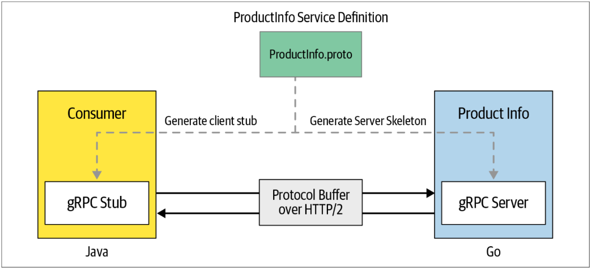

# Intro to gRPC

<div align="center">
    
</div>

- The language that we specify in the service definition is known
as an **Interface Definition Language (IDL)**.

- Using that service definition, you can generate the server-side code known as a **server skeleton**, and client-side code, known as a **client stub**.

- The methods that you specify in the service interface definition can be remotely invoked by the client side as easily as making a local function invocation.

- The network communication between the service and consumer takes place over HTTP/2.

- gRPC uses **protocol buffers** as the IDL to define the service interface. Protocol buffers are a language-agnostic, platform-neutral, extensible mechanism to serializing structured data.

## Online Repo for Book
https://github.com/grpc-up-and-running/samples

## Install Protobuf Compiler
```bash
$ sudo apt update
$ sudo apt install protobuf-compiler
$ protoc
```

## Download and Install Go and Go-gRPC libraries
Download Go: https://go.dev/dl/  
Install Go: https://go.dev/doc/install

Add below to `~/.profile` and source the `.profile` file.
```bash
export PATH=$PATH:/usr/local/go/bin
export PATH=$PATH:$(go env GOPATH)/bin
```

Install the protocol compiler plugins for Go using the following commands:
```bash
$ go install google.golang.org/protobuf/cmd/protoc-gen-go@v1.28
$ go install google.golang.org/grpc/cmd/protoc-gen-go-grpc@v1.2
```

## Install Java
```bash
$ sudo apt install default-jdk
$ java --version
```

## Service Definition
gRPC service definition of ProductInfo service using protocol buffers
```protobuf
// ProductInfo.proto

// service definition begins with specifying the 
// protocol buffer version (proto3) that we use
syntax = "proto3";
// Package names are used to prevent name clashes 
// between protocol message types
package ecommerce;

// Defining the service interface of a gRPC service
service ProductInfo {
  // Remote method to add a product that returns 
  // the product ID as the response
  rpc addProduct(Product) returns (ProductID);
  // Remote method to get a product based on the product ID
  rpc getProduct(ProductID) returns (Product);
}

// Definition of the message format/type of Produc
message Product {
  string id = 1;
  string name = 2;
  string description = 3;
}
// User-defined type for product identification number
message ProductID {
  string value = 1;
}
```

- The message is the data structure that is exchanged between client and service. `Product` and `ProductID`.
- Here the number assigned to each message field is used to uniquely identify the field in the message. So, we can’t use the same number in two different fields in the same message definition.
- According to the protocol buffer rule, we can only have one input parameter in a remote method and it can return only one value. If we need to pass multiple values to the method like in the `addProduct` method, we need to define a message type and group all the values as we have done in the Product message type

## gRPC Server
Use service definition to generate the server- or client-side code using the protocol buffer compiler **protoc**.

1. Implement the service logic of the generated service skeleton by overriding the
service base class.
2. Run a gRPC server to listen for requests from clients and return the service
responses.

gRPC server-side implementation of ProductInfo service with Go
```go
import (
...
"context"
pb "proto"
"google.golang.org/grpc"
...
)
// ProductInfo implementation with Go
// Add product remote method
func (s *server) AddProduct(ctx context.Context, in *pb.Product) (
*pb.ProductID, error) {
// business logic
}
// Get product remote method
func (s *server) GetProduct(ctx context.Context, in *pb.ProductID) (
*pb.Product, error) {
// business logic
}
```

Running a gRPC server for ProductInfo service with Go
```go
func main() {
  lis, _ := net.Listen("tcp", port)
  s := grpc.NewServer()
  pb.RegisterProductInfoServer(s, &server{})
  if err := s.Serve(lis); err != nil {
    log.Fatalf("failed to serve: %v", err)
  }
}
```

## gRPC Client

The client stub provides the same methods as the server, which your client code can invoke; the client stub translates them to remote function invocation network calls that go to the server side.

So for the ProductInfo service use case, we can generate the client stub for Java while our server side is implemented with Go.

gRPC client to invoke a remote method of service
```java
// Create a channel using remote server address
ManagedChannel channel = ManagedChannelBuilder.forAddress("localhost", 8080)
        .usePlaintext(true)
        .build();

// Initialize blocking stub using the channel
ProductInfoGrpc.ProductInfoBlockingStub stub =
ProductInfoGrpc.newBlockingStub(channel);

// Call remote method using the blocking stub
StringValue productID = stub.addProduct(
  Product.newBuilder()
  .setName("Apple iPhone 11")
  .setDescription("Meet Apple iPhone 11." +
    "All-new dual-camera system with " +
    "Ultra Wide and Night mode.")
  .build());
```
