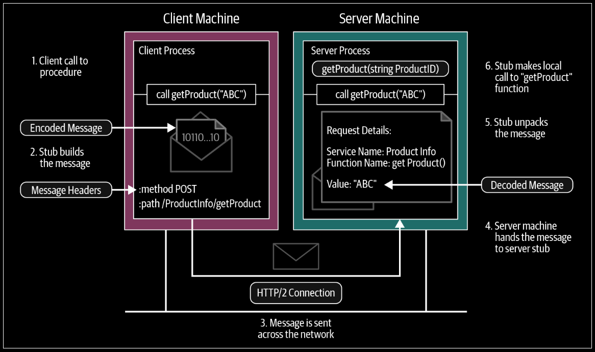
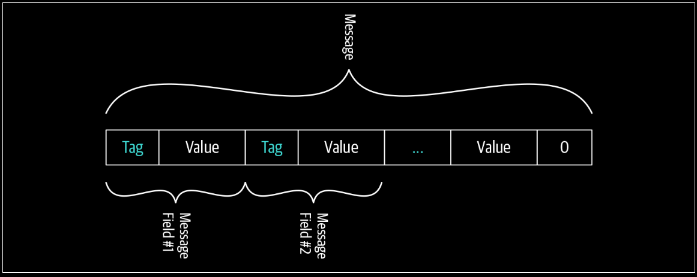
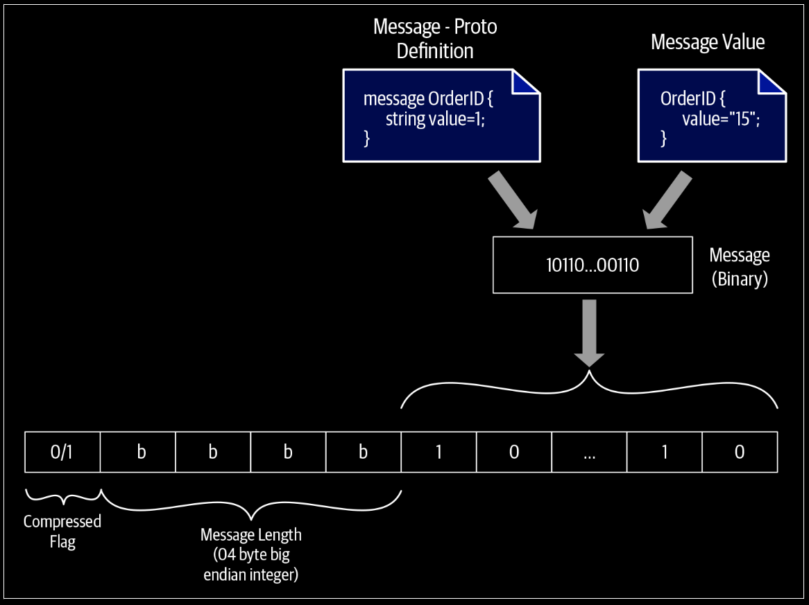
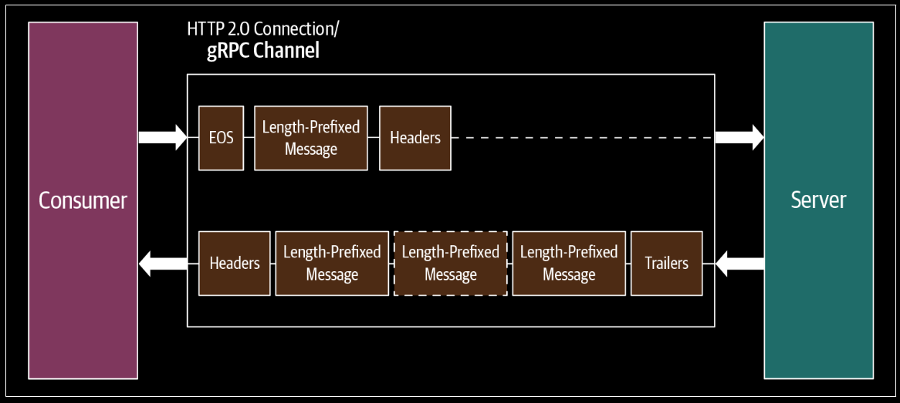
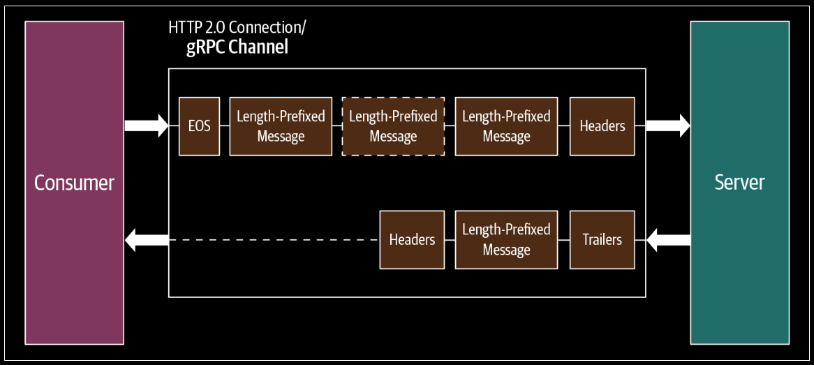
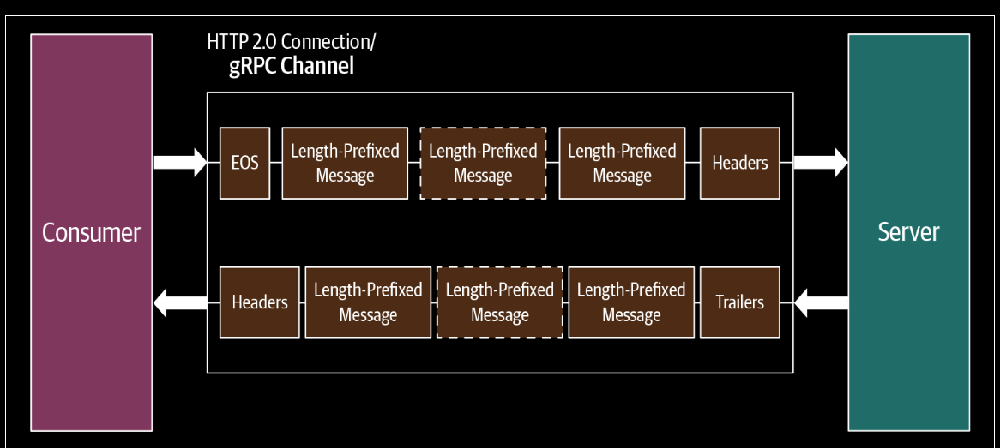
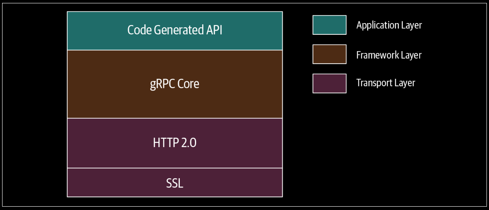

# gRPC: Under the Hood

<div align="center">
    
</div>

---

- The client process calls the getProduct function in the generated stub.
- The client stub creates an HTTP POST request with the encoded message. In gRPC, all requests are HTTP POST requests with content-type prefixed with `application/grpc`. The remote function (/ProductInfo/getProduct) that it invokes is sent as a separate HTTP header. The HTTP request message is sent across the network to the server machine.
- The HTTP request message is sent across the network to the server machine.
- When the message is received at the server, the server examines the message headers to see which service function needs to be called and hands over the message to the service stub.
- The service stub parses the message bytes into language-specific data structures.
- Then, using the parsed message, the service makes a local call to the getProduct function.
- The response from the service function is encoded and sent back to the client. The response message follows the same procedure that we observed on the client side (response→encode→HTTP response on the wire); the message is unpacked and its value returned to the waiting client process.

## Protocol buffer encoded byte stream

<div align="center">
    
</div>

---

## gRPC over HTTP/2
In HTTP/2, all communication between a client and server is per‐ formed over a single TCP connection that can carry any number of
bidirectional flows of bytes.

- `Stream`: A bidirectional flow of bytes within an established connection. A stream may carry one or more messages.
- `Frame`: The smallest unit of communication in HTTP/2. Each frame contains a frame header, which at a minimum identifies the stream to which the frame belongs.
- `Message`: A complete sequence of frames that map to a logical HTTP message that consists of one or more frames. This
allows the messages to be multiplexed, by allowing the client and server to break down the message into independent
frames, interleave them, and then reassemble them on the other side.

## Length-Prefixed Message Framing
Length-prefix is a message-framing approach that writes the size of each message before writing the message itself.

Before the encoded binary message there are 4 bytes allocated to specify the size of the message. In gRPC communication, 4 additional bytes are allocated for each message to set its size. The size of the message is a finite number, and allocating 4 bytes to represent the message size means gRPC communication can handle all messages up to 4 GB in size.

<div align="center">
    
</div>

---

## Request Message
The request message is the one that initiates the remote call. In gRPC, the request message is always triggered by the client application and it consists of three main components: request headers, the length-prefixed message, and the end of stream flag. The remote call is initiated once the client sends request headers. Then, length-prefixed messages are sent in the call. Finally, the EOS (end of stream) flag is sent to notify the recipient that we finished sending the request message.

```
HEADERS (flags = END_HEADERS)
:method = POST
:scheme = http
:path = /ProductInfo/getProduct
:authority = abc.com
te = trailers
grpc-timeout = 1S
content-type = application/grpc
grpc-encoding = gzip
authorization = Bearer xxxxxx
```

## Response Message
Response message also consists of three main components: response headers, length-prefixed messages, and trailers. When there is no length-prefixed message to send as a response to the client, the response message consists only of headers and trailers.

```
HEADERS (flags = END_HEADERS)
:status = 200
grpc-encoding = gzip
content-type = application/grpc
```

## Understanding the Message Flow in gRPC Communication Patterns
### Simple RPC
In simple RPC you always have a single request and a single response in the communication between the gRPC server and gRPC client. The
request message contains headers followed by a length-prefixed message, which can span one or more data frames. An end of stream (EOS) flag is added at the end of the message to half-close the connection at the client side and mark the end of the request message. Here “half-close the connection” means the client closes the connection on its side so the client is no longer able to send messages to the server but still can listen to the incoming messages from the server. The server creates the response message only after receiving the complete message on the server side. The response message contains a header frame followed by a length-prefixed message. Communication ends once the server sends the trailing header with status details.

<div align="center">
    
</div>

---

### Server-streaming RPC
From the client perspective, both simple RPC and server-streaming RPC have the same request message flow. In both cases, we send one request message. The main difference is on the server side. Rather than sending one response message to the client, the server sends multiple messages. The server waits until it receives the completed request message and sends the response headers and multiple length-prefixed messages. Communication ends once the server sends the trailing header with status details.

<div align="center">
    
</div>

---

### Client-streaming RPC
In client-streaming RPC, the client sends multiple messages to the server and the server sends one response message in reply. The client first sets up the connection with the server by sending the header frames. Once the connection is set up, the client sends multiple length-prefixed messages as data frames to the server. In the end, the client half-closes the connection by sending an EOS flag in the last data frame. In the meantime, the server reads the messages received from the client. Once it receives all messages, the server sends a response message along with the trailing header and closes the connection.

<div align="center">
    
</div>

---

### Bidirectional-streaming RPC
In this pattern, the client sets up the connection by sending header frames. Once the connection is set up, the client and server both send length-prefixed messages without waiting for the other to finish. Both client and server send messages simultaneously. Both can end the connection at their side, meaning they can’t send any more messages. 

<div align="center">
    
</div>

---

## gRPC Implementation Architecture
gRPC is natively supported by the C/C++, Go, and Java languages. gRPC also provides language bindings in many popular languages such as Python, Ruby, PHP, etc. These language bindings are wrappers over the low-level C API.

<div align="center">
    
</div>

---

## Summary
RPC builds on top of two fast and efficient protocols called protocol buffers and HTTP/2. Protocol buffers are a data serialization protocol that is a language-agnostic, platform-neutral, and extensible mechanism for serializing structured data. Once serialized, this protocol produces a binary payload that is smaller in size than a normal JSON payload and is strongly typed. This serialized binary payload then travels over the binary transport protocol called HTTP/2.

HTTP/2 is the next major version of the internet protocol HTTP. HTTP/2 is fully multiplexed, which means that HTTP/2 can send multiple requests for data in parallel over a single TCP connection. This makes applications written in HTTP/2 faster, simpler, and more robust than others.

All these factors make gRPC a high-performance RPC framework.